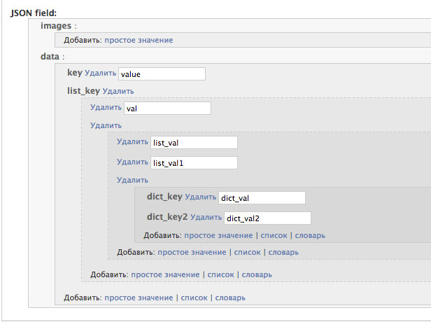

DJSON-FIELD
===========
*Provide json model field, json form field and json widget for Django framework*

Installation
------------
1. Run from command line ```pip install djson-field```
2. Add ```djson_field``` to your settings package



Usage
-----

Виджет для визуального редактирования JSON-а в Djano админке.

Для удобного редактирования свойств и поведения виджетов полей необходимо
прописать правила в параметр ```rules``` JSONField'а:

```python
    [
        ([], {
            "allow_removing": False,
            "verbose_name": None,
            "help_text": None,
            "hidden": False,
        }),
        (["key"], {
            "actions": ["add_dict", "add_plain", "add_list"],
        }),
        (["key", _(r".*")], {
            "type": {
                "field1": models.IntegerField(),
                "field2": models.CharField(max_length=255)
            },
            "actions": ["add_plain", "add_dict"],
            "allow_item_removing": False
        }),
        (["key", _(r".*"), _(r".*")], {
            "type": models.CharField(max_length=255),
            "actions": [],
            "allow_item_removing": False
        }),
    ]
```

Правила представляют собой список кортежей, где в качестве первого элемента
передаются ключи ноды (regexp), а во втором - параметры для этого уровня
ноды. В ключах ноды можно передавать на каком уровне вложенности будут работать
данные правила.

Параметры правил
################

| Ключ                     | Значение                     |
|--------------------------|------------------------------|
|```allow_removing```      | будет ли возможность удалять |
|```actions```             | доступные действия для текущей ноды |
|```type```                | тип поля для отображения поля (по умолчанию CharField, можно любое) |
|```allow_item_removing``` | будет ли возможность удалять дочерние ноды |
|```help_text```           | подсказка |
|```hidden```              | будет ли поле скрытым |
|```type_key```            | поле на которое к которому будет привян тип (```type```) |
|```verbose_name```        | подробное описание поля |


Так же в ```JSONField``` можно передать ```initial``` параметр, в котором
описать начальную структуру JSON-а

```python
    {
        "key": {
            "key1": 1,
            "key2": 2
        }
    }
```
